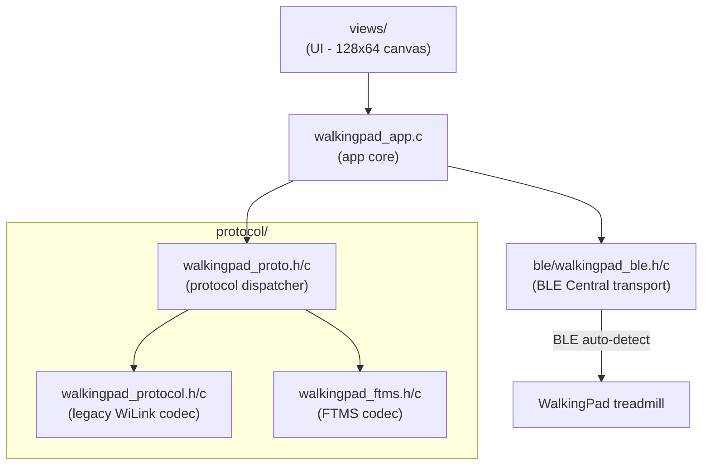

# WalkingPad Controller for Flipper Zero

<center>
    
</center>

A Flipper Zero application that lets you monitor and control your KingSmith WalkingPad treadmill over Bluetooth Low Energy -- directly from the Flipper, with no external hardware.

## Supported Devices

The app auto-detects the protocol based on the BLE service UUID advertised by the treadmill.

### Legacy WiLink Protocol (Service UUID `0xFE00`)

| Model | Status |
|-------|--------|
| WalkingPad A1 | Supported |
| WalkingPad A1 Pro | Supported |
| WalkingPad R1 Pro | Supported |
| WalkingPad R2 Pro | Supported |
| Lifespan Fitness M2 | Supported (rebrand) |
| Dynamax Treadmill | Partial (R1 clone) |

Features: speed, time, distance, steps, auto/manual mode switching.

### FTMS Protocol (Service UUID `0x1826`)

| Model | Status |
|-------|--------|
| KS-HD-Z1 / Z1D | Supported |
| KS-MC21-* | Supported |
| KS-SMC21C-* | Supported |
| ZP-ZEALR1-* | Supported |

Features: speed, time, distance, steps (KingSmith extension), calories, dynamic speed range from device. No auto/manual mode (FTMS is always manual).

## Requirements

This app uses native BLE Central / GATT Client APIs. This requires:

- **[Moon Firmware](https://github.com/KaraZajac/Moon-Firmware)** (or a compatible custom firmware with BLE Full stack and exported GATT Client APIs)
- The BLE Full stack (`stm32wb5x_BLE_Stack_full_fw.bin`) flashed on Core2

## Architecture



### Connection Flow

1. **Scan** -- Scans for devices advertising `0xFE00` (legacy) or `0x1826` (FTMS)
2. **Detect** -- Protocol auto-detected from advertised service UUID
3. **Connect** -- BLE Central connection established
4. **Discover** -- Service and characteristic discovery
5. **Subscribe** -- Notification subscriptions (legacy: FE02; FTMS: 0x2ACD + 0x2ADA)
6. **Ready** -- Commands dispatched through protocol-specific encoder

## Protocol Details

### Legacy WiLink

6-byte command frames: `[0xF7, 0xA2, action, value, CRC, 0xFD]`

| Action | Value | Description |
|--------|-------|-------------|
| `0x00` | `0x00` | Query status |
| `0x01` | speed | Set speed (speed x10, e.g. 30 = 3.0 km/h) |
| `0x02` | mode | Set mode (0=auto, 1=manual, 2=standby) |
| `0x04` | `0x01` | Start belt |

Status responses: `[0xF8, 0xA2, ...]` with speed, mode, time (3-byte BE), distance, steps.

### FTMS

Standard Bluetooth Fitness Machine Service with KingSmith extensions.

| Characteristic | UUID | Purpose |
|----------------|------|---------|
| Treadmill Data | `0x2ACD` | Speed, distance, time, calories, steps (notify) |
| Control Point | `0x2AD9` | Start/stop/speed commands (write) |
| Speed Range | `0x2AD4` | Min/max/increment (read) |
| Machine Status | `0x2ADA` | Belt events (notify) |

Control Point opcodes: `0x00` REQUEST_CONTROL, `0x02` SET_SPEED (uint16 LE, 0.01 km/h), `0x07` START, `0x08` STOP.

## Building

```bash
# Using ufbt pointed at Moon Firmware SDK
ufbt
```

## Controls

- **Up/Down** -- Cycle through actions
- **OK** -- Execute selected action
- **Back** -- Exit app

## Running Tests

```bash
cd tests
make run
```

Runs both legacy protocol tests (11) and FTMS protocol tests (15).

## References

- [Moon Firmware](https://github.com/KaraZajac/Moon-Firmware) -- Custom firmware with BLE Full stack
- [mcdax/hass-walkingpad](https://github.com/mcdax/hass-walkingpad) -- FTMS protocol reference
- [ph4r05/ph4-walkingpad](https://github.com/ph4r05/ph4-walkingpad) -- Legacy protocol reference
- [tim-oster/walkingpad](https://github.com/tim-oster/walkingpad) -- Go protocol reference

## License

Copyright (c) 2026 Lukas 'dotWee' Wolfsteiner <lukas@wolfsteiner.media>

Licensed under the [_Do What The Fuck You Want To_](/LICENSE) public license
